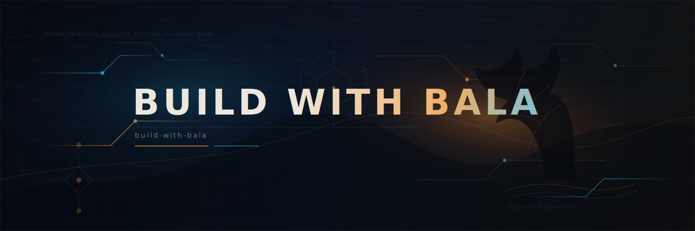

<!-- ====================================================== -->
<!--                    BUILD WITH BALA                     -->
<!--    GitHub Profile README · v2.0 · 2026-05-28           -->
<!--    NOTE on rename: when you rename `techy-zai-fi`      -->
<!--    to `build-with-bala`, find/replace `techy-zai-fi`   -->
<!--    in this file once — widgets will follow.            -->
<!-- ====================================================== -->

<div align="center">

<!-- ============ HERO BANNER (custom SVG, generated via Codex CLI 2026-05-28) ============ -->


<br/>

<!-- ============ ANIMATED TYPING ============ -->
<a href="https://github.com/techy-zai-fi">
  
</a>

<br/><br/>

<!-- ============ IDENTITY CHIPS ============ -->


-a371f7?style=for-the-badge&logo=meditation&logoColor=white&labelColor=0d1117)


<br/>

<a href="https://www.linkedin.com/in/balaji-g-999665190"></a>
&nbsp;
<a href="https://buildwithbala.in"></a>
&nbsp;
<a href="https://www.youtube.com/@buildwithbala"></a>
&nbsp;
<a href="https://instagram.com/buildwithbala"></a>

<br/>


</div>

<br/>

```ts
const bala = {
  origin:      "Tamil Nadu, India",
  education:   "B.Tech CSE @ VIT Chennai → MBA-DBM @ IIM Bodh Gaya '27",
  founded:     ["ZAi-Fi (AI eval engine for NEET coaching) — Co-founder, ex-CTO"],
  shipped:     ["InzightED · hierarchical RAG · LLM-as-evaluator · Neo4j knowledge graph"],
  now:         "Interning @ Neosophical Labs on Ahoum (the world's first spiritual AI)",
  building:    ["build-with-bala.in", "IIM-BG eCAP portal", "exercise-checker-app", "prep-lab"],
  recovering:  "femur fracture · 3 surgeries · 9 months non-weight-bearing · walking since Dec 2025",
  philosophy:  "My body slowed down. My builder mindset did not.",
  athlete:     "district-level badminton — working my way back to the court",
};
```

<br/>

---

<br/>

## <picture><source media="(prefers-color-scheme: dark)" srcset="https://github.githubassets.com/images/icons/emoji/unicode/1f527.png" /></picture> &nbsp; Currently building

<table>
  <tr>
    <td width="33%" valign="top">
      <h4>🕉️ Ahoum</h4>
      <sub>"Operating System for the Soul." AI + ancient wisdom + 668-facet personality engine. <a href="https://seeker.ahoum.com">seeker.ahoum.com</a></sub>
    </td>
    <td width="33%" valign="top">
      <h4>🎓 eCAP @ IIM-BG</h4>
      <sub>Elective Course Allocation Portal. Bid-currency mechanics. Real student impact. <a href="https://ecap.iimbg.ac.in/ecap_2025/">live</a></sub>
    </td>
    <td width="33%" valign="top">
      <h4>🏋️ exercise-checker</h4>
      <sub>Android + ML Kit. Real-time form check, rep counting. Built while my body was relearning movement.</sub>
    </td>
  </tr>
  <tr>
    <td valign="top">
      <h4>📚 prep-lab</h4>
      <sub>Open-source, exam-agnostic CBT platform with AI-powered analytics. The evolution of what we shipped at InzightED.</sub>
    </td>
    <td valign="top">
      <h4>📡 supplylens</h4>
      <sub>Real-time logistics situational-awareness cockpit. Gemini-powered. Disruption radar + fleet tracking.</sub>
    </td>
    <td valign="top">
      <h4>🎮 clan-conqueror-central</h4>
      <sub>The portal for IIM-BG's Clash of Clans inter-batch sports event. <a href="https://github.com/techy-zai-fi/clan-conqueror-central">repo</a></sub>
    </td>
  </tr>
</table>

<br/>

---

<br/>

##  &nbsp; The stack I actually ship with

<div align="center">

<!-- AI / ML -->

<br/>


<br/><br/>

<!-- Backend / Data -->


<br/><br/>

<!-- Frontend / Mobile -->


<br/><br/>

<!-- The MBA layer -->


</div>

<br/>

---

<br/>

##  &nbsp; The numbers

<div align="center">


&nbsp;


<br/>


&nbsp;


</div>

<br/>

<!-- ============ SNAKE CONTRIBUTION ANIMATION ============ -->
<picture>
  <source media="(prefers-color-scheme: dark)" srcset="https://raw.githubusercontent.com/techy-zai-fi/techy-zai-fi/output/github-snake-dark.svg" />
  <source media="(prefers-color-scheme: light)" srcset="https://raw.githubusercontent.com/techy-zai-fi/techy-zai-fi/output/github-snake.svg" />
  
</picture>

<br/>

<!-- ============ TROPHY SHELF ============ -->
<div align="center">

</div>

<br/>

---

<br/>

##  &nbsp; The journey, in one diagram


<br/>

---

<br/>

##  &nbsp; What I think about most days

<div align="center">

<a href="https://github.com/piyushsuthar/github-readme-quotes">
  
</a>

</div>

<br/>

> If I could not run physically, I could still build digitally.
> &nbsp;
> *— me, somewhere between surgery two and surgery three*

<br/>

---

<br/>

##  &nbsp; The thesis I'm actually testing

<table>
<tr>
<td width="50%" valign="top">

### 🛠️ As a builder

Most software ships fast and reasons shallow. I want to ship systems that **reason structurally** — knowledge graphs over flat embeddings, evaluators over generators, decisions over outputs.

InzightED was the first attempt. Ahoum is the second. The next one is the one I'm not allowed to talk about yet.

</td>
<td width="50%" valign="top">

### 🧘 As a person who got injured

You can lose nine months to a body and still come back as more of yourself than you were before. The recovery wasn't a setback — it was a **distillation**.

The arrogance left. The shipping didn't.

</td>
</tr>
</table>

<br/>

---

<br/>

##  &nbsp; If you want to reach me

<div align="center">

I'm always up for talking about: **AI architectures · founder economics · IIM-BG specifically · recovery · badminton · or what spiritual AI even means**.

I'm not great at: small talk, faux humility, or pretending I have it figured out.

<br/>

<a href="https://www.linkedin.com/in/balaji-g-999665190">
  
</a>
&nbsp;
<a href="https://buildwithbala.in">
  
</a>

<br/><br/>

<sub>I'm public admin on <a href="https://github.com/ZAIFI-BUSINESS-SOLUTIONS-PVT-LTD">ZAi-Fi</a> and <a href="https://github.com/Ahoum-Dev">Ahoum-Dev</a>. The real shipping happens there.</sub>

</div>

<br/>

<!-- ============ FOOTER WAVE ============ -->


<div align="center">
<sub>Last refreshed 2026-05-28 · Built through breakdowns. Still building forward.</sub>
</div>
